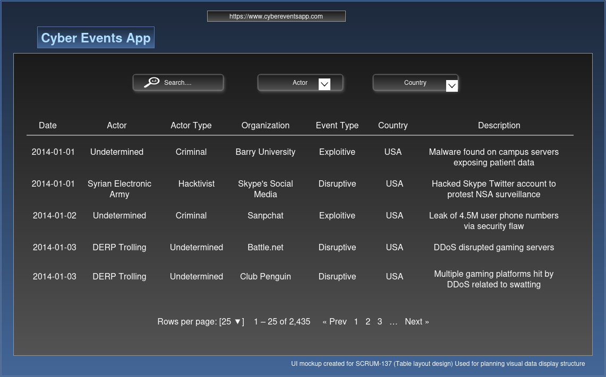

# SCRUM-137 – Table Layout for Data Display
**Epic:** SCRUM-7 (Display data in a table)  
**Sprint:** 2  
**Assignee:** Pablo  
**Repository:** github.com/gabriel-zomignani/cyber-incidents-explorer  

---

## 📘 Dataset Used
**File:** `data/cyber_clean.csv`  
This dataset contains cleaned cyber security incidents from 2014–2025.  
It includes attributes describing date, actors, industries, event types, and regional/country flags for analysis and visualization.

---

## 🧩 Dataset Columns

1. event_date  
2. year  
3. month  
4. actor  
5. actor_type  
6. organization  
7. industry_code  
8. industry  
9. motive  
10. event_type  
11. event_subtype  
12. description  
13. source_url  
14. country  
15. actor_country  
16. state  
17. county  
18. nato  
19. eu  
20. shanghai_coop  
21. oas  
22. mercosur  
23. au  
24. ecowas  
25. asean  
26. opec  
27. gulf_coop  
28. g7  
29. g20  
30. aukus  
31. csto  
32. oecd  
33. osce  
34. five_eyes  

---

## 🧾 Sample Rows
2014-01-01,2014,1,Undetermined,Criminal,Barry University,61,Educational Services,Undetermined,Exploitive,Exploitation of End Hosts,Barry University notifies patients of its Foot and Ankle Institute that their medical records and personal information may have been hacked by a malware found in May.,https://www.beckershospitalreview.com/healthcare-information-technology/barry-university-informs-patients-of-malware-caused-data-breach.html,United States of America,Undetermined,Florida,Miami-Dade,1,0,0,1,0,0,0,0,0,0,1,1,1,0,1,1,1
2014-01-01,2014,1,Undetermined,Criminal,Record Assist LLC,54,"Professional, Scientific, and Technical Services",Undetermined,Exploitive,Exploitation of Application Server,"Record Assist LLC notifies of an unauthorized access possibly compromising residents' names, addresses, credit card numbers and Social Security numbers.",https://privacyrights.org/data-breaches/record-assist-llc,United States of America,Undetermined,Texas,Harris,1,0,0,1,0,0,0,0,0,0,1,1,1,0,1,1,1
2014-01-01,2014,1,Syrian Electronic Army,Hacktivist,Skype's Social Media,54,"Professional, Scientific, and Technical Services",Protest,Disruptive,Message Manipulation,"The Syrian Electronic Army hacks Skype's Twitter account, Facebook page, and blog with a message against NSA surveillane.",http://thenextweb.com/microsoft/2014/01/01/skypes-twitter-account-blog-get-hacked-sea-demanding-end-spying/,United States of America,Syrian Arab Republic,Washington,King,1,0,0,1,0,0,0,0,0,0,1,1,1,0,1,1,1
2014-01-02,2014,1,Undetermined,Criminal,Snapchat,51,Information,Undetermined,Exploitive,Exploitation of Application Server,Greyhat hackers publish the partial phone numbers belonging to more than 4.5 million Snapchat users after exploiting a recently disclosed security weakness that officials of the service had described as theoretical.,http://arstechnica.com/security/2014/01/greyhats-expose-4-5-million-snapchat-phone-numbers-using-theoretical-hack/,United States of America,Undetermined,California,Los Angeles,1,0,0,1,0,0,0,0,0,0,1,1,1,0,1,1,1
2014-01-03,2014,1,DERP Trolling,Undetermined,Battle.net,51,Information,Undetermined,Disruptive,External Denial of Service,"The servers for Steam, Origin, Battle.net, and League of Legends are brought down temporarily by apparent DDoS attacks that seem to be related to a swatting attack on an individual known for streaming games.",http://arstechnica.com/gaming/2014/01/multiple-gaming-platforms-hit-with-apparent-ddos-attacks/,United States of America,Undetermined,California,Orange,1,0,0,1,0,0,0,0,0,0,1,1,1,0,1,1,1
2014-01-03,2014,1,DERP Trolling,Undetermined,Club Penguin,51,Information,Undetermined,Disruptive,External Denial of Service,"The servers for Steam, Origin, Battle.net, and League of Legends are brought down temporarily by apparent DDoS attacks that seem to be related to a swatting attack on an individual known for streaming games.",http://arstechnica.com/gaming/2014/01/multiple-gaming-platforms-hit-with-apparent-ddos-attacks/,United States of America,Undetermined,Undetermined,Undetermined,1,0,0,1,0,0,0,0,0,0,1,1,1,0,1,1,1

# Table Design Plan
**Purpose**
Display imported cyber incident data in a readable and sortable table view.
The user should be able to search, filter and explore events by year, country, state, description.

# Sorting and Filtering
- Sort by `event_date` (default descending)
- Sort by `actor`, `country`, or `industry`
- Filter by:
  - Country (dropdown)
  - Year (slider or dropdown)
  - Actor Type (checkbox list)
- Search bar for keywords in Actor or Organization

## Pagination

- Default 25 rows per page  
- Option: 25 / 50 / 100  
- “Next” and “Previous” buttons visible under the table  

##  Empty or Missing Values

- Show “—” for missing cells  
- Keep table sortable even with missing data  
- Do not hide incomplete rows  

#  Accessibility Notes

- Table headers `<th>` have scope attributes for screen readers  
- High contrast colors for severity  
- Keyboard navigation supported (arrow keys and tab focus) 

##  Wireframes (To Attach)

Add to `docs/ui/table_layout/` when ready:
- `table_view_wireframe.png`
- `filter_controls_wireframe.png`

#  Acceptance Criteria

- Data displays correctly with defined columns  
- Sorting and filtering function as described  
- Pagination and accessibility pass testing  
- Layout ready for integration (SCRUM-138)  

---

##  Linked Work

- **Parent Story:** SCRUM-7 “Display data in a table”  
- **Next Task:** SCRUM-138 “Implement table component in the UI”

---

### Wireframe Screenshot

